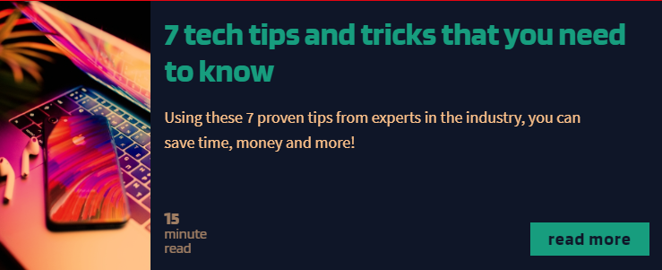

## Tech Blog Component

## Summary

This is a small component for a blog or website that utilizes flexbox to create a reponsive, mobile-first design. This is one of several CSS projects I'm building to re-familiarize myself with the important CSS topics needed to create great-looking sites and components.

 

 

 

For mobile, the layout is tight and stacked for smaller screens and easy reading

 

 

  

On larger screens, the flex axis flips to rows to take up more space and spread out.

  
  

**Author**
 
**Robin Fussell** _- Software Developer_ | [LinkedIn](https://www.linkedin.com/in/robin-fussell17/)